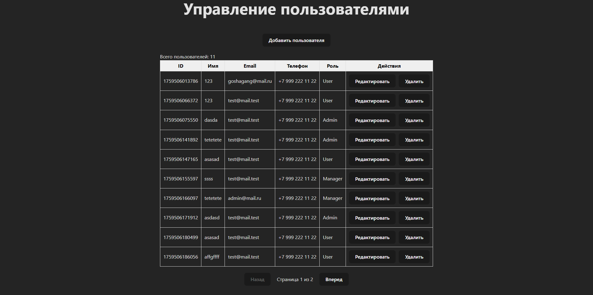
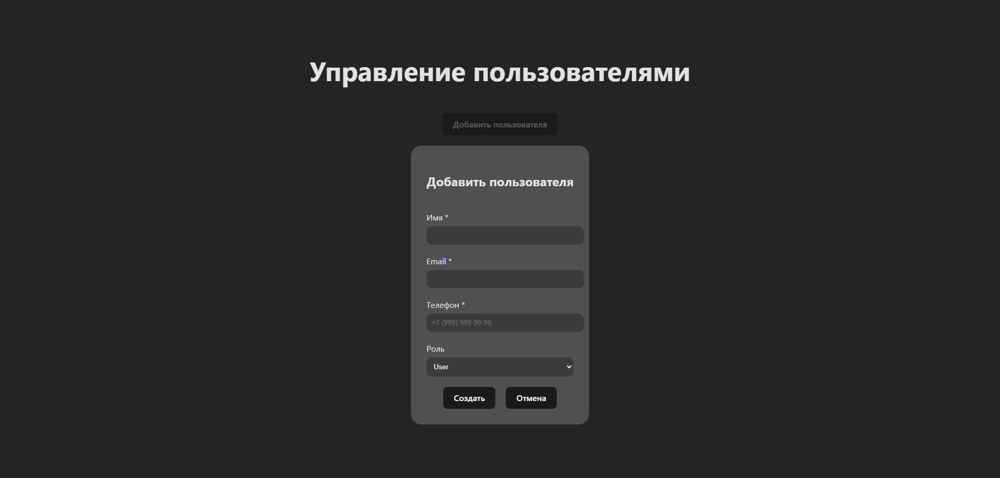

# Тестовое задание upjet

Все условия соблюдены.

## Запуск

1. Установить зависимости

```bash
# В корне проекта
npm i
```

2. Запустить проект

```bash
# В корне проекта
npm run dev
```

## Реализовано

1. Таблица
2. Создание пользователя
3. Редактирование пользователя
4. Удаление пользователя
5. Пагинация
6. Валидация полей

> Данные о пользователях хранятся в localstorage.

## Внешний вид

Главная



Форма



## Деплой

https://jajapepe.github.io/test-upjet/
